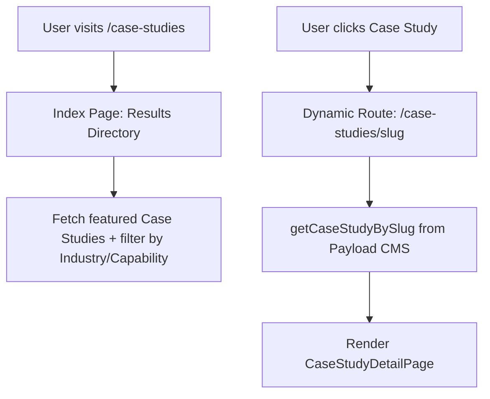

# Tech-Jersey Studio — Phase 3 Case Study Engine Planning Report
## Module: Dynamic Transformation Stories & Lexical Parser

---

## Executive Summary
Case studies are the ultimate conversion engine for Tech-Jersey Studio. They validate technical capabilities (like Document Intelligence and WhatsApp Automation) with real-world financial and operational metrics.

This planning report outlines the architecture to transition Case Studies from a basic database collection into a fully integrated Case Study Engine. This includes a dedicated page route, dynamic detail layout, a robust Payload Lexical JSON rich-text renderer, dynamic service relationship mapping, and seed scripts.

---

## 1. Page Architecture & Dynamic Routes

The Case Study Engine will introduce two primary frontend route structures:



### Route Configurations
1.  **Index Route (`/case-studies/page.tsx`)**:
    *   *Layout*: A grid index of case studies featuring high-contrast hover blocks, categories, and client logos.
    *   *Filter Ribbon*: A tab selector to filter by capability (WhatsApp, CRM, AI, Websites) and industry (Real Estate, Finance, Logistics).
2.  **Detail Route (`/case-studies/[slug]/page.tsx`)**:
    *   *Hero Section*: Deep-dive header displaying client profile, industry badges, and a bold metric row (e.g. `₹4.2L Saved Monthly`, `90% Lead Capture`).
    *   *Challenge vs Solution Grid*: A split column comparing the manual hurdles against the automated systems.
    *   *System Architecture diagram*: Visual system workflows showing API integrations and data hops.
    *   *Key Outcomes List*: Highlighting numerical achievements.

---

## 2. CMS Schema Changes: Dynamic Relationships

Currently, `src/payload/collections/CaseStudies.ts` utilizes a static select field for `category`:
```typescript
{
  name: 'category',
  type: 'select',
  options: [ ... ]
}
```
This requires manual code alignment and fails to capture rich relation metadata.

### Proposed DB Diff
We will transition the static category into a dynamic **Relationship** field pointing to the `services` collection:
```typescript
{
  name: 'relatedServices',
  type: 'relationship',
  relationTo: 'services',
  hasMany: true,
  label: 'Related Studio Capabilities',
  admin: {
    description: 'Select the services deployed in this case study (links bi-directionally).'
  }
}
```

### Benefits of Dynamic Relationship Model
*   **Bi-directional Linking**: The service page `/services/document-intelligence` can dynamically query the database for all case studies that reference its ID. If a new case study is added, it instantly renders on the service page with zero code modifications.
*   **Scale**: Adding new services in the future automatically registers them as options in the Case Study admin panel.

---

## 3. Lexical Rich Text Renderer

Payload CMS uses a rich nested Lexical JSON model. Currently, the blog page uses a placeholder block. For Phase 3, we will implement a robust, reusable `<RichText />` renderer inside `src/components/RichText.tsx` to handle nested node serialization.

### Parser Design
```typescript
interface LexicalNode {
  type: string;
  text?: string;
  children?: LexicalNode[];
  format?: number;
  tag?: string;
  listType?: 'number' | 'bullet';
}

export default function RichText({ content }: { content: any }) {
  if (!content || !content.root) return null;
  return serializeNode(content.root);
}
```

The serializer will map:
*   `heading` nodes -> `<h1>` to `<h6>` based on tag level.
*   `paragraph` nodes -> `<p>`.
*   `list` nodes -> `<ul>` or `<ol>` based on `listType`.
*   `quote` nodes -> `<blockquote>` with elegant left-border neon accents.
*   Text formats (bold, italic, code styling tags) mapped dynamically through bitwise bitmasks.

---

## 4. Cross-Linking Conversion Strategy

To turn reader traffic into qualified inquiries:
1.  **Contextual Service CTAs**: At the bottom of a Case Study detailing lead capture automation, render an inline component pulling the metadata of the related service:
    > Deployed System: **AI Lead Qualification Router**
    > [Build This System →] (links directly to booking workflow)
2.  **Highlight Case Snapshot**: Keep service detail pages populated with their respective snap cards. The snap card will link back to the full case study route `/case-studies/[slug]`.
3.  **Bottom Case Engine Audit CTA**: Prompt users to see if their metrics can scale: "Calculate similar savings for your pipeline."

---

## 5. Database Seeding & Case Studies
We will write `seed_case_studies.js` using `libsql` to inject 3 case studies representing key capabilities, using generic names:
1.  **Lead-leakage solution for Real Estate Developer**: Deployed CRM workflow automation. (Saved 35+ hours/week, 4.2L monthly revenue recovered).
2.  **Layout-agnostic parser for Logistics Operator**: Deployed Document AI pipelines. (120 hours/month saved in manual invoice entry).
3.  **WhatsApp conversational router for D2C Store**: Deployed WhatsApp Official API integration. (45% lead qualification improvement, 24/7 client response).

---

## Open Questions

> [!NOTE]
> 1. **Index Directory Layout**: Should case studies have their own page at `/case-studies`, or should they be integrated as a tabbed filter directly inside the existing `/journal` list?
> 2. **Mermaid Diagrams**: Do you want live system-architecture diagrams rendered using Mermaid.js inside the Case Study details, or static CSS mock diagram blocks?
